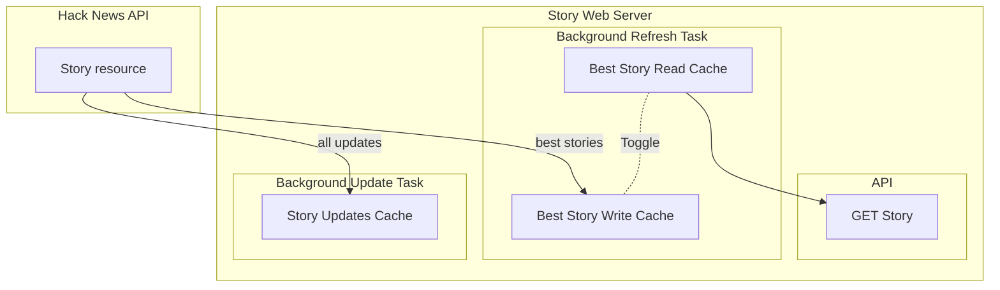

```mermaid
flowchart
    gs[GET Story]
    rc[Best Story Read Cache]
    sr[Story resource]
    uc[Story Updates Cache]
    wc[Best Story Write Cache]

    subgraph Hack News API
        sr
    end

    subgraph Story Web Server
        subgraph API
            gs
        end
        subgraph Background Refresh Task
            rc-->gs
            rc-.Toggle.-wc
            sr--best stories-->wc
        end
        subgraph Background Update Task
            sr--all updates-->uc
        end
    end
```